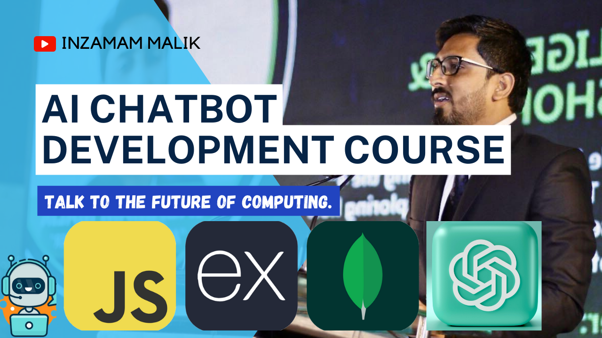

# Saylani AI Chatbot Batch 3

## Class Code

## [Chatbot Course Syllabus](https://github.com/mInzamamMalik/Chatbot-Development-Syllabus)

## [Complete Course YouTube Playlist](https://www.youtube.com/playlist?list=PLaZSdijfCCJAaiGINILElinr8wlgNS7Vy)

**Note:** This is a very expensive course and this is not any ordinary youtube tutorial rather, this is a proper job oriented academic training conducted by a professional software developer with 10+ years of software development experience.
Videos are long and descriptive if you are looking for short tutorial this playlist is not for you, rather you are suppose to spare few weeks to take this training and you are supposed to follow all the instructions such making assignments given by instructor, just watching this video without hands-on coding will not help.
